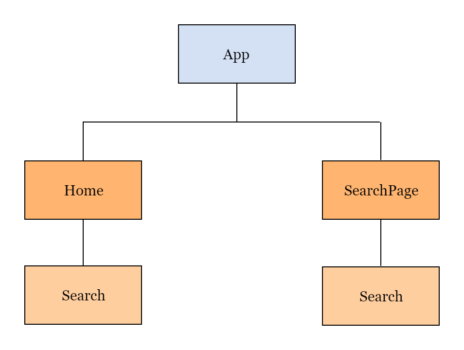

# google-clone-react
Simplistic clone of google.com using ReactJS.

Find deployed version [here](https://clone-285f4.web.app/) and alternative link - [here](https://clone-285f4.firebaseapp.com/), using Firebase Hosting.

## Components Breakdown
Excluding the React-Router-DOM components and the MaterialUI Icon Components, here is the component structure of the app -

### Home Component
This is used to define the Homepage of the Google Clone. It contains - 
* Header
  * Left - _About_ and _Store_ links.
  * Right - _Gmail_ and _Images_ links, _App_ and _UserProfile_ icons.
* Body
  * Google Logo 
  * Search Component - Encompasses the Search Bar and the search buttons 
  
### SearchPage Component
This is used to define the Search Results Page of the Google Clone. It contains - 
* Google Logo
* Search Component - To display the Search Bar on top
* Options Panel 
  * Left - _All_, _Images_, _News_, _Shopping_, _Maps_ and _More_ links,
  * Right - _Settings_ and _Tools_ links.
* Results Panel
  * Results stats
  * Results
    * URL
    * Title
    * Description
  
### Search Component - `props={hideButtons}`
This is used to define the Search Bar, and the _Google Search_ and _I'm feeling lucky_ buttons. It encloses a `<form>` field that contains - 
* Search Icon
* Input Field to input the search terms.
* Mic Icon
* _Google Search_ button - `type="submit"`
* _I'm feeling lucky_ button

The buttons are only rendered on the screen if the `hideButtons = true`. They are still a part of the DOM however, and maintain their functionality i.e. the form is still submitted if the the user types in a search term and presses the Enter key.

## App Logic
All the links have been created using React-Router DOM - but most of them haven't yet been implemented by me. In this clone project, I have only implemented the main page, and the search results page.

We use the Google Custom Search API - needs an API key and a SearchEngine ID, which returns search results in JSON format to render the results here. Using the custom hook **useGoogleSearch**, we fetch the JSON data - and then display the necessary information on the SearchPage.

We also use React Context API to retrieve the search term entered by the user in the **Home** page, inside the **SearchPage**.

All the icons and buttons have been used from MaterialUI to get the same look and feel as that of the official Google website, and the font and background-colors have also been kept as close to the original as possible.

** NOTE ** - To run the same project on your personal system, please replace the API_KEY in the keys.js file by your own custom API key, and the SEARCH_ENGINE_ID in the useGoogleSearch.js file with your search engine id.

**The free version of the Custom Search API from Google will only handle 100 search requests per day**